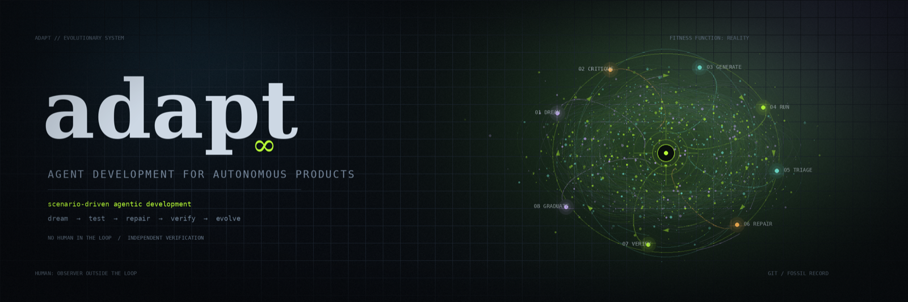

[](https://github.com/Sotiris-Bekiaris/adapt/actions/workflows/ci.yml)
[](./LICENSE)
[](https://nodejs.org)

**A**gent **D**evelopment for **A**utonomous **P**roduc**T**s — a closed-loop multi-agent system that evolves a software product with **no human in the loop**.

Point adapt at *your* product repository. A team of cooperating coding agents dreams up what the product should become next, expresses each ambition as user-level **scenarios**, validates those scenarios against the *running* app in a real browser, converts real failures into deduplicated work items, implements the smallest safe fix, and **independently re-verifies** the original scenario before anything counts as done. Then it goes around again.

**What you get:** a `.adapt/` workspace inside the target repo (scenarios, an append-only run ledger, work items, a narrated decision log), a workspace commit every cycle plus fix branches the agents are instructed to commit on, and a live web console to watch it happen.

There is no "done" and no success state. **Success *is* the continued evolution of the product.** The human is the observer outside the loop, never an approver inside it. The methodology has a name: **Scenario-Driven Agentic Development (SDAD)**.

> 📖 Prefer to *watch* how it works? **[Watch the loop →](https://sotiris-bekiaris.github.io/adapt/story.html)** is an interactive, scroll-driven walkthrough of the whole loop, hosted on GitHub Pages — nothing to clone or install. The project page lives at **[sotiris-bekiaris.github.io/adapt](https://sotiris-bekiaris.github.io/adapt/)**. (The source of both is [`story.html`](./story.html) and [`readme.html`](./readme.html); GitHub renders `.html` files as source, so use the hosted links to actually view them.)

---

## Read this before you run it

adapt is an **experimental** system that lets AI agents modify a codebase **without asking you first**. Understand all of this before pointing it at anything:

- **Agents run with permission prompts disabled by default.** Every role is spawned as `claude … --dangerously-skip-permissions` (`src/engine/claudeCode.ts`), so agents edit files, run shell commands, and make git commits with **no approval step**. That default is deliberate: the loop is unattended, and there is nobody to approve anything. Setting `"engine": { "skipPermissions": false }` in `.adapt/config.json` really does stop the flag being passed — every command that loads a config builds its engine through `engineFor()` (`src/cli/commands/engineFor.ts`), which honours it. Be clear about what you get: the agents still run headless (`claude -p`), with no terminal attached to answer a prompt, so the operations the loop depends on can simply be refused and the cycle produces nothing. Turning it off is a way to watch adapt fail safely, not a way to make an unattended run safe. **Isolation — a throwaway repo, a lane worktree, a disposable database — is the primary control.**
- **`adapt init` itself launches an agent, and no config can govern it.** Before any config exists, `init` runs the **Scout** against your whole repo to write `.adapt/north-star.md`. That is a real Claude Code invocation: it reads your source, costs tokens, and is constructed with no config at all (`src/cli/commands/init.ts`) — so `engine.command`, `engine.type: "stub"`, and `engine.skipPermissions` have no effect on it. If the `claude` CLI is missing, a template north-star is written instead.
- **Point it at a throwaway repo or a dedicated branch — never at code you cannot afford to lose.** Lanes are git worktrees that `adapt lane reset` will `git reset --hard` back to a baseline, and `adapt lane destroy` deletes the worktree and its branch. Work in a lane is not recoverable.
- **Use an isolated, disposable database.** Setup/teardown hooks reset the target's data between runs. Never aim it at a database with real or production data. Set `hooks.requireSetupHook: true` so a scenario with no resolvable setup hook is recorded `blocked` instead of running against unmanaged state.
- **It costs money and, by default, runs forever.** `run.maxCycles` and `run.maxWallClockSeconds` both default to `null` — no bound. `adapt run` will loop until you press Ctrl-C, a control file stops it, or three consecutive cycles error out. **Set both guardrails before any unattended run.**
- **Never expose the console or monitor beyond localhost — and loopback is not a security boundary.** They bind to `127.0.0.1` with no authentication, no CSRF protection, and no origin check on the WebSocket, and the monitor's `/ws` accepts `control` frames that start, pause, and stop agent loops. Any other process on the machine can drive it, and so can any web page you happen to visit, since a browser can open `ws://127.0.0.1:4500/ws` from any origin. Run the monitor only while you are watching it. Details in [SECURITY.md](./SECURITY.md).
- **Credentials go in environment variables, never in `.adapt/config.json`.** `adapt evolve` runs `git add .adapt && git commit` in the target repo every cycle, so anything in that workspace ends up in the target's history. Use the gitignored env files (`scripts/deepseek.env`, `scripts/jira.env` — templates provided as `*.env.example`).

Provided **as-is, without warranty** — see [LICENSE](./LICENSE). You are responsible for what the agents do on your machine. Security posture and reporting: [SECURITY.md](./SECURITY.md).

---

## Table of contents

- [Read this before you run it](#read-this-before-you-run-it)
- [What adapt is](#what-adapt-is)
- [Try it in 5 minutes (no API key for the loop)](#try-it-in-5-minutes-no-api-key-for-the-loop)
- [Documentation](#documentation)
- [What "self-improving" means (and does not)](#what-self-improving-means-and-does-not)
- [Core principles — the constitution](#core-principles--the-constitution)
- [The agents](#the-agents)
- [Separation of powers — permissions](#separation-of-powers--permissions)
- [The loop](#the-loop)
- [The two-repo model](#the-two-repo-model)
- [The `.adapt/` workspace](#the-adapt-workspace)
- [Scenarios: the contract](#scenarios-the-contract)
- [Baselines and lanes](#baselines-and-lanes)
- [Tech stack](#tech-stack)
- [Getting started on a real target](#getting-started-on-a-real-target)
- [CLI reference](#cli-reference)
- [Configuration reference](#configuration-reference)
- [What the loop does to your git history](#what-the-loop-does-to-your-git-history)
- [Repo map](#repo-map)
- [Scripts](#scripts)
- [Troubleshooting](#troubleshooting)
- [Safeguards — the hard rules](#safeguards--the-hard-rules)
- [Development](#development)
- [Project status, limitations, and non-goals](#project-status-limitations-and-non-goals)
- [Contributing](#contributing)
- [License](#license)

---

## What adapt is

adapt is a **generic, plug-and-play framework**. No target-product logic lives in this repo. You point it at *any* full-stack product via config, and it becomes target-specific only at runtime — by reading the plugged project's source, UI, and configuration.

A team of cooperating coding agents runs a perpetual evolutionary loop against that product:

1. **Dream** the next ambition for the product.
2. **Critique** it — does it carry real value, or is it bloat?
3. **Generate** user-level scenarios that express the ambition.
4. **Validate** those scenarios against the *running* product, like a real user in a real browser.
5. **Triage** real failures into deduplicated, classified work items.
6. **Repair** the product with the smallest safe change.
7. **Verify** — independently rerun the original scenario before anything counts as done.

Then it goes around again. Forever. There is no terminal state — the loop is the point.

The whole system behaves like **an organism adapting to environmental pressure**: the north-star is its genome, scenarios are the selection pressure, reality is the fitness function, and git is the fossil record.

## Try it in 5 minutes (no API key for the loop)

adapt ships a deterministic `stub` engine (`src/engine/stubEngine.ts`) that drives the entire pipeline — workspace, scenario registry, run ledger, orchestrator state, decision log, console — without Claude Code, a browser, an API key, or a running app. It is what the whole test suite runs on. Use it to see the machinery before spending anything.

**One exception, and it is unavoidable:** step 2 below is `adapt init`, which spawns the Scout agent before any config exists. If the `claude` CLI is installed and signed in, that one call is a real, billable agent run that can take minutes. There is no flag to skip it. To keep the walkthrough genuinely free, run it on a machine without `claude` on `PATH` — `init` then writes a template north-star and continues.

```bash
git clone https://github.com/Sotiris-Bekiaris/adapt.git
cd adapt
npm install

# 1. A throwaway target repo.
mkdir /tmp/adapt-demo && cd /tmp/adapt-demo && git init && git commit --allow-empty -m "init"
cd -

# 2. Scaffold the workspace. NOTE: init runs the Scout agent against the target if the
#    `claude` CLI is installed and signed in; without it, a template north-star is written.
npm run adapt -- init /tmp/adapt-demo --app-base-url http://localhost:3000

# 3. Configure, and switch the engine to the stub.
cp /tmp/adapt-demo/.adapt/config.example.json /tmp/adapt-demo/.adapt/config.json
#    edit .adapt/config.json:  "engine": { "type": "stub", ... }

# 4. Make the example scenario runnable — files under scenarios/examples/ are NOT scanned.
cp /tmp/adapt-demo/.adapt/scenarios/examples/example.login.md \
   /tmp/adapt-demo/.adapt/scenarios/SCN-001.md

# 5. Run it.
npm run adapt -- run-scenarios /tmp/adapt-demo
```

It prints:

```
  inconclusive SCN-001  A user can log in

1 scenario(s) run — 1 inconclusive.
```

Then look at what appeared, and take one more step:

```bash
cat /tmp/adapt-demo/.adapt/scenarios/index.json   # the generated scenario registry
ls  /tmp/adapt-demo/.adapt/scenario-runs/         # one RUN-*.json per execution — the run ledger

npm run adapt -- orchestrate /tmp/adapt-demo      # validate → triage → repair → verify
ls  /tmp/adapt-demo/.adapt/decision-log/          # <YYYY-MM-DD>.ndjson — the narrated timeline
```

`npm run adapt -- evolve /tmp/adapt-demo` goes one further and prepends dream → critique → generate.

**What this proves:** the workspace layout, scenario parsing and indexing, the run ledger, orchestrator state, artifact schemas, and the event/decision-log pipeline all work end to end.
**What it does not prove:** nothing here touches a browser or a real product. The stub engine returns no verdicts, so every run is recorded `inconclusive`, no work items are triaged, and no demands are approved. Real pass/fail requires the `claude-code` engine and a running app.

## Documentation

| Document | What it is |
|---|---|
| [`story.html`](./story.html) → [**view it live**](https://sotiris-bekiaris.github.io/adapt/story.html) | Interactive, scroll-driven walkthrough of the loop. |
| [`readme.html`](./readme.html) → [**view it live**](https://sotiris-bekiaris.github.io/adapt/) | The project page published to GitHub Pages (deployed as `index.html`). It is a presentation layer — **this README is the canonical source of truth**; where the two differ, believe the README, and believe `src/` over both. |
| [docs/README.md](./docs/README.md) | Index of everything under `docs/`, current and historical. |
| [docs/ARCHITECTURE.md](./docs/ARCHITECTURE.md) | The map of the codebase — read it before changing code. |
| [docs/first-real-run.md](./docs/first-real-run.md) | Runbook for pointing adapt at a real product with a real model. |
| [docs/superpowers/specs/2026-05-25-adapt-design.md](./docs/superpowers/specs/2026-05-25-adapt-design.md) | The design blueprint. Source comments cite it as "blueprint §N" — this is the document those section numbers refer to. |
| [docs/superpowers/plans/](./docs/superpowers/plans/) · [docs/design-notes.md](./docs/design-notes.md) | Historical record: per-phase implementation plans, and the raw origin transcript the whole idea grew out of. |
| [CONTRIBUTING.md](./CONTRIBUTING.md) · [SECURITY.md](./SECURITY.md) · [CHANGELOG.md](./CHANGELOG.md) · [CODE_OF_CONDUCT.md](./CODE_OF_CONDUCT.md) | Project process, threat model, notable changes, conduct. |

## What "self-improving" means (and does not)

**It means:** the *product repository* improves over time, autonomously — features get added, bugs get fixed, the north-star is raised, scenario coverage grows.

**It does NOT mean** the agents rewrite their own prompts or behavior. **The agents are static.** Only the product evolves: its code, its scenarios, its tests, its north-star. The machinery that drives evolution does not evolve.

## Core principles — the constitution

1. **The scenario is the contract.** A scenario is a real user goal plus the visible outcome that proves it — not the code, not the issue, not the UI's current behavior.
2. **Reality is the judge.** A change is "done" only when an *independent* agent confirms the scenario passes against the *running* product in a real browser.
3. **Durable artifacts over agent memory.** Agents communicate through versioned files and tracked work items, never conversational memory.
4. **No human in the loop; human as observer.** Judgment is replaced by *structural* safeguards: independent verification, adversarial critique, attempt limits.
5. **Git is the intended safety net — and only partly an enforced one.** adapt itself commits the `.adapt/` workspace once per `evolve` cycle (`commitWorkspace`, `src/orchestrator/git.ts`), and nothing else. The fix branch `adapt/<ITEM-ID>` and the commit of the product change are *instructions in the Implementation agent's prompt* (`src/agents/prompts/implementation.ts`); no adapt code creates that branch, makes that commit, or checks that either happened. Replayable, revertible history is the design intent — the target repo's own git state is what actually delivers it.
6. **Separation of powers by permission.** Different agents get deliberately different knowledge and tools so the loop cannot self-approve its own mistakes.
7. **Observability is a first-class subsystem**, not a log file.
8. **Demand must have a source.** Autonomy without pressure is drift; the Dreamer + Critic pair is the engine that creates pressure.

## The agents

All roles are instances of a coding-agent engine (default: **Claude Code, headless**) launched by the orchestrator with a specific prompt, working directory, and MCP server set. Each role's behaviour lives in exactly one file under `src/agents/prompts/`.

0. **Scout** — runs once, during `adapt init`. Reads the target repo (README, manifest, source tree, config, tests) and writes `.adapt/north-star.md`, the vision every later cycle steers toward. No browser, no code writes.
1. **Dreamer** — reads the north-star and the current product state and proposes the next ambition. Explores the running app via Chrome DevTools MCP. Highest drift risk; constrained by the Critic and reality-grounded verification.
2. **Critic** — a skeptical product owner. Challenges each candidate demand (real value vs. bloat, busywork, reward-hacking, duplication). Only survivors enter the backlog. Reads source; no browser.
3. **Scenario Generator** — source-aware for discovery only. Turns approved demands into user-centered, black-box scenarios with stable IDs, personas, preconditions, steps, expected outcomes, failure signals, tags, and priority.
4. **Scenario Runner** — black-box, **no source access** (its prompt forbids reading the repo). Executes scenarios against the running app via Playwright MCP, like a user. Classifies each run as `passed | failed | blocked | flaky | invalid | inconclusive` and captures evidence (failing step, expected vs. actual, console errors, network errors, screenshots). Does not create work items.
5. **Failure Triage** — reads failed runs, deduplicates (one root cause breaking 20 scenarios → *one* work item, not 20), classifies, and creates work items with full evidence. May inspect the failing page with Chrome DevTools MCP.
6. **Implementation Agent** — full source access. Reads work item + scenario + evidence, works on branch `adapt/<ITEM-ID>`, makes the smallest safe change, adds tests where practical, runs checks, and moves the item to *In Review* / *Ready for Verification*. **Must not** mark Done, weaken a scenario, or delete failing scenarios.
7. **Verification Agent** — independent from the Implementation Agent; black-box, forbidden from reading the source or the fix diff. Reruns the *exact* original scenario against the fixed app and owns the verdict: `verified → Done` | `still failing → reopen`.
8. **Graduation Agent** — when a scenario has passed `limits.gradPassThreshold` times in a row, it freezes that scenario into a deterministic Playwright spec under `playwrightTestDir` and marks the scenario `graduated`, so the regression runs cheaply in CI without an LLM. Never touches product code.

**Orchestrator** — **not an LLM**. A deterministic state machine (`src/orchestrator/`). It owns: which scenarios are runnable, which agent runs next, the scenario↔work-item mapping, retries and attempt limits, duplicate-failure handling, cycle scheduling, and emitting events to observability.

## Separation of powers — permissions

Permissions are deliberately uneven so the loop *cannot* self-approve its own mistakes. Browser access is assigned in `src/engine/mcp.ts`; Jira MCP is exposed only to triage, implementation, and verification, and only when `mcp.jira.enabled` is true — which it is not by default, so the "Jira MCP" column below describes an opt-in configuration.

| Role | Source code | Browser MCP | Jira MCP | Writes product code | Owns "done" |
|---|---|---|---|---|---|
| **Scout** (at `init`) | read | none | none | no — writes `north-star.md` | no |
| **Dreamer** | read | Chrome DevTools (explore) | none | no | no |
| **Critic** | read | none | none | no | no |
| **Scenario Generator** | read (discovery) | Chrome DevTools (discovery) | none | no — writes scenarios | no |
| **Scenario Runner** | **no** | Playwright | none | no | no |
| **Failure Triage** | read | Chrome DevTools (inspect the failing page) | create / update | no | no |
| **Implementation** | full | Chrome DevTools | update only, never Done | **yes** | **no** |
| **Verification** | **no** | Playwright | update, incl. Done | no | **yes — only after re-running the scenario** |
| **Graduation** | read | Chrome DevTools | none | no — writes a Playwright spec | no |
| **Orchestrator** (code, not an LLM) | metadata only | none | n/a | no | records the verdict |

## The loop

A full evolutionary pass runs these stages, in order — then loops back around, with no terminal state:

```
        ┌──────────────────────────────────────────────────────────────┐
        │                                                              │
        ▼                                                              │
   ┌─────────┐   ┌──────────┐   ┌──────────┐   ┌──────────┐           │
   │  DREAM  │──▶│ CRITIQUE │──▶│ GENERATE │──▶│ VALIDATE │──┐        │
   └─────────┘   └──────────┘   └──────────┘   └──────────┘  │        │
     Dreamer       Critic       Generator        Runner       │        │
                                                              ▼        │
   ┌──────────┐   ┌──────────┐   ┌──────────┐                         │
   │  VERIFY  │◀──│  REPAIR  │◀──│  TRIAGE  │                         │
   └──────────┘   └──────────┘   └──────────┘                         │
   Verification  Implementation    Triage                             │
        │                                                              │
        └──────────────────────────────────────────────────────────────┘
                    (no success state — evolution continues)
```

The **spine** is the inner subset, and it is what `adapt orchestrate` runs on its own:

```
   VALIDATE ──▶ TRIAGE ──▶ REPAIR ──▶ VERIFY
```

`adapt evolve` = the demand engine (`DREAM → CRITIQUE → GENERATE`) followed by one full spine cycle, then graduation of any scenario that has passed often enough. `adapt run` repeats `evolve` until a guardrail trips.

## The two-repo model

adapt is two repositories that never blur together:

- **`adapt/`** — the generic framework (*this* repo). Static, no target logic: orchestrator, console, agent prompts, schemas, CLI.
- **`<target-project>/`** — *any* full-stack product you point adapt at. The agents read its source and are instructed to **commit changes there** (see [principle 5](#core-principles--the-constitution) for what adapt enforces and what it only asks for). A per-target `.adapt/` workspace is created on plug-in.

The framework only ever learns *what your product is* at runtime, by reading the target's source, UI, and config.

## The `.adapt/` workspace

`adapt init` scaffolds this workspace inside the target repo; the loop fills the rest in.

```
<target-project>/
  .adapt/
    config.example.json      # written by init: a fully-defaulted template
    config.json              # YOU create it: cp config.example.json config.json, then edit
    north-star.md            # the product vision (the "genome") — written by the Scout at init
    scenarios/               # the contract: user-level scenarios (hand-authored + agent-generated)
      examples/              #   TEMPLATES ONLY — this directory is never scanned
        example.login.md
      index.json             #   generated registry: id, title, status, priority, tags, lastResult
    scenario-runs/           # append-only run ledger (generated)
      <RUN-ID>.json          #   the finalized record
      <RUN-ID>.agent.json    #   the raw verdict the runner agent wrote
    work-items/              # canonical local issue payloads (Jira optional, via MCP)
      <ITEM-ID>.json
      triage-*.json  impl-*.json  verify-*.json   # per-agent result sidecars
    demands/                 # DMD-###.json — dream → critique output (written by `evolve`)
    baselines/               # <name>.json manifests (written by `baseline create`)
    decision-log/            # narrated timeline — the experiment's primary deliverable
      <YYYY-MM-DD>.ndjson
    verification-reports/    # created by init; reserved — nothing writes here yet
    state.db                 # SQLite orchestrator state (+ state.db-wal, state.db-shm)
    lane.json                # lane manifest — lane worktrees only
    control.json             # live pause / stop / maxCycles state for a lane loop
    loop.pid                 # pid of a running lane loop
    .gitignore               # written by init
```

Only `scenario-runs/` and the runtime files (`state.db*`, `lane.json`, `loop.pid`) are ignored by the scaffolded `.gitignore`. Everything else in `.adapt/` — including `config.json` — is committed into the target repo by `adapt evolve`. **Keep credentials out of `config.json`; pass them as environment variables.**

**ID discipline everywhere:** `SCN-###` (scenarios), `RUN-<timestamp>-<seq>` (runs), `ITEM-###` (work items), `DMD-###` (demands), plus commit SHA and branch. Every artifact is traceable to the scenario it serves and the commit that changed it.

## Scenarios: the contract

A scenario is a markdown file with **YAML frontmatter** (machine metadata, including optional `hooks.setup` / `hooks.teardown`) and a **body** (persona, preconditions, user-level steps, expected outcome, failure signals).

Rules the registry enforces (`src/scenarios/registry.ts`, `src/orchestrator/runScenario.ts`):

- Only `*.md` files **directly inside `.adapt/scenarios/`** are indexed. Subdirectories — including the scaffolded `examples/` — are ignored.
- Each `id` must be unique across the directory; a duplicate id fails the registry rebuild.
- Statuses that run in a normal pass: `ready`, `active`, `regression`. `run-scenarios --scenario <id>` runs a named scenario regardless of status.
- Run results are **append-only**, recorded in `scenario-runs/` — never written back into the scenario body. Intent and results stay separate.

## Baselines and lanes

You can race multiple evolutionary strategies from the same starting point and compare them.

- A **baseline** is a shared, *named fork point* of the target (e.g. `v1`): git tag `adapt-baseline/<name>` plus a manifest at `.adapt/baselines/<name>.json`.
- A **lane** is an isolated lineage forked from a baseline: its own git worktree, branch `adapt/<laneId>`, port block, console port, and *optionally its own model*. Lanes evolve in **parallel** and independently — so one lane driven by one model and another by a different model can evolve from identical genomes, and you can see which organism thrives.

What actually happens, in order:

1. `baseline create <name> <targetRepo>` requires a **clean working tree** and at least one commit. It creates the tag, writes the manifest, and **makes a commit** (`chore(adapt): baseline <name>`) in the target repo.
2. `lane create <laneId> <targetRepo> --baseline <name>` requires that tag. It creates a worktree under `lanes.rootDir` — resolved **relative to the target repo**, default `../adapt-lanes` — on branch `adapt/<laneId>`, allocates a port block from `environment.portBase` (stride `environment.portStride`), assigns a console port from `console.port` + slot index, then runs the target's `environment.up` and `environment.reset`. Lane ids must match `^[a-z0-9][a-z0-9-]{0,38}$`.
3. `lane start` runs the lane's `adapt run` loop; `--detach` backgrounds it and writes `.adapt/loop.pid`, which `lane stop` and `lane list` read.
4. `lane reset` runs `git reset --hard` to the baseline tag, deletes the lane's `state.db*`, and runs `environment.reset`. `lane destroy` runs `environment.down`, removes the worktree, and deletes the branch. Both are irreversible.

Bringing a lane's database and app up is the **target's** responsibility, via the `environment` block in its `.adapt/config.json`. [`scripts/lane-up.template.sh`](./scripts/lane-up.template.sh) is a worked example (Supabase + pnpm) to copy and adapt.

Watch every lane at once with [`adapt monitor`](#cli-reference).

## Tech stack

- **adapt itself:** Node + TypeScript (ESM), run via `tsx`. Runtime deps: `commander` (CLI), `zod` (config + artifact schemas, and the exported JSON Schema via `z.toJSONSchema`), `better-sqlite3` (orchestrator state store), `ws` (console/monitor streams), `gray-matter` (scenario frontmatter).
- **Black-box surface** (Runner, Verification): **Playwright MCP** (`@playwright/mcp`, launched with `--isolated` so browser state never leaks between scenarios).
- **White-box surface** (Dreamer, Generator, Triage, Implementation, Graduation): **Chrome DevTools MCP** (`chrome-devtools-mcp`).
- **Agent engine:** **Claude Code, headless** — streaming structured output feeds the live console. A deterministic `stub` engine (`engine.type: "stub"`) drives the same pipeline with no LLM.
- **Work tracker:** adapt ships its own. `.adapt/work-items/*.json` is the canonical store (`src/tracker/localTracker.ts`) — plain JSON files, no server, nothing to install. **Jira** is an **opt-in mirror**, reached through the `mcp-atlassian` MCP server (`uvx mcp-atlassian`), and is **off by default** — see [Configuration reference](#configuration-reference) for how to turn it on.

## Getting started on a real target

### Prerequisites

| Requirement | Check | Needed for |
|---|---|---|
| **Node 22+** and npm | `node -v` · `npm -v` | everything |
| **git** | `git --version` | everything; the target must be a git repo with ≥1 commit for baselines and lanes |
| **Claude Code CLI**, installed and signed in | `claude --version` | every agent run, including `adapt init`. Not needed with `engine.type: "stub"` |
| **Chrome / Chromium** | `google-chrome --version` (or Chrome.app) | Chrome DevTools MCP — set `mcp.chromeDevTools.enabled: false` to skip |
| **npx** with network access | `npx -v` | Playwright MCP and Chrome DevTools MCP are fetched as `@latest` on first use; Playwright also downloads browsers |
| A C++ toolchain (fallback only) | — | `better-sqlite3` is native; it uses a prebuild when one matches your Node, and compiles otherwise |
| **Your target app, already running** at `appBaseUrl` | `curl -I <appBaseUrl>` | scenario runs. adapt never starts your app — `startCommand` is reserved and unused |

No issue tracker is in that list. Work items are plain JSON files under `.adapt/work-items/`, written by adapt's built-in local tracker (`src/tracker/localTracker.ts`). Nothing else is required.

### Optional integrations

| Integration | Also needs | Turn it on with |
|---|---|---|
| **Jira**, as a mirror of the local work tracker — triage files issues, implementation and verification move them | Your own **Jira Server/DC or Cloud** instance, and **`uvx`** (from [uv](https://docs.astral.sh/uv/)): the MCP server is launched as `uvx mcp-atlassian` | `mcp.jira.enabled: true`, plus `jira.projectKey` and the `JIRA_*` environment variables — all detailed under [`jira`](#jira). Defaults to `false`. |

The local tracker stays canonical either way; Jira never becomes the source of truth.

### 1. Install

adapt is distributed as **source**, not on npm (`package.json` is deliberately `"private": true`, so `npm i -g adapt` will not work).

```bash
git clone https://github.com/Sotiris-Bekiaris/adapt.git
cd adapt
npm install
```

Then either prefix every command with `npm run adapt --`, or put `adapt` on your `PATH` from this checkout:

```bash
npm link            # symlinks bin/adapt.mjs; reverse with: npm unlink -g adapt
```

`bin/adapt.mjs` re-executes `src/cli/index.ts` through `tsx`, so the clone must stay where it is.

### 2. Start your target app

adapt drives a *running* product. Start it yourself and confirm the base URL answers.

### 3. Scaffold the workspace

```bash
npm run adapt -- init /path/to/target-repo --app-base-url http://localhost:3000
```

This creates `.adapt/`, writes `config.example.json` and the example scenario, and runs the **Scout** agent to author `.adapt/north-star.md` (a live agent call — see the [warning section](#read-this-before-you-run-it)). Review the north-star: it is the vision every later cycle steers toward.

### 4. Configure

```bash
cp /path/to/target-repo/.adapt/config.example.json /path/to/target-repo/.adapt/config.json
```

At minimum, edit:

- `appBaseUrl` — where your running app answers.
- `hooks.setup` / `hooks.teardown` — the commands that reset an **isolated** test database. Consider `hooks.requireSetupHook: true`.
- `run.maxCycles` and `run.maxWallClockSeconds` — both `null` (unbounded) by default.

Leave Jira alone unless you want it: `mcp.jira.enabled` is `false` by default, and the built-in local tracker handles work items with no further setup. To mirror into a Jira you already run, see [Optional integrations](#optional-integrations).

### 5. Seed a scenario

```bash
cp /path/to/target-repo/.adapt/scenarios/examples/example.login.md \
   /path/to/target-repo/.adapt/scenarios/SCN-001.md
```

Edit it to describe a real user goal in your product, and keep `status: ready`. Files under `examples/` are never run.

### 6. Run — smallest step first

```bash
npm run adapt -- run-scenarios /path/to/target-repo      # validate only
npm run adapt -- triage-failures /path/to/target-repo    # turn failures into work items
npm run adapt -- orchestrate /path/to/target-repo        # one bounded spine pass
npm run adapt -- evolve /path/to/target-repo             # one full evolutionary pass
npm run adapt -- run /path/to/target-repo --console 4399 # continuous, with the live console
```

For a longer walkthrough of a first real run, see [docs/first-real-run.md](./docs/first-real-run.md).

> **Note:** every command takes the **target product** repo path as its argument — not this repo. Run `npm run adapt -- …` from the adapt checkout; after `npm link`, `adapt …` works from anywhere.

## CLI reference

### Single-step

| Command | Description |
|---|---|
| `run-scenarios <targetRepo> [--scenario SCN-001] [--fail-on-failure]` | Run every scenario whose status is `ready`, `active`, or `regression`. With `--scenario`, run exactly that id regardless of its status. Exits 0 even when scenarios fail — failures are normal input to the loop — unless `--fail-on-failure` is given. |
| `triage-failures <targetRepo>` | Triage un-triaged `failed` runs into deduplicated, classified work items (capped by `limits.maxItemsPerRun`). |

### Bounded passes

| Command | Description |
|---|---|
| `orchestrate <targetRepo>` | One bounded autonomous pass: **validate → triage → repair → verify** (the spine), then graduation. |
| `evolve <targetRepo>` | One full evolutionary pass: **dream → critique → generate**, then the spine. Commits the `.adapt/` workspace in the target repo at the end. |

### Continuous

| Command | Description |
|---|---|
| `run <targetRepo> [--console <port>]` | Repeat `evolve` until a guardrail trips, a lane control file says stop, or you press Ctrl-C. With `--console`, serves the live event WebSocket + dashboard on that port. Ctrl-C once = stop after the current cycle; twice = immediate exit (130). |

### Observability

| Command | Description |
|---|---|
| `console <targetRepo> [--port 4399]` | Serve the mission-control dashboard for one repo, replaying a single stub agent so you can see the event pipe work. It shows events from its **own** process only — to watch a real loop, serve the console from the loop itself with `adapt run <targetRepo> --console <port>`. |
| `monitor <targetRepo> [--port 4500]` | Watch every lane in one dashboard: live where a lane loop is streaming, replayed from each lane's decision log otherwise. Can pause, stop, and start lane loops. |

### Plug-in

| Command | Description |
|---|---|
| `init <targetRepo> [--app-base-url http://localhost:3000]` | Scaffold `.adapt/` inside a target repo and run the Scout to write `north-star.md`. |

### Baselines (shared fork points)

| Command | Description |
|---|---|
| `baseline create <name> <targetRepo>` | Tag the current target HEAD as `adapt-baseline/<name>`, write the manifest, and commit it. Requires a clean working tree. |
| `baseline list <targetRepo>` | List baselines from `.adapt/baselines/`. |

### Lanes (parallel evolutionary lineages)

| Command | Description |
|---|---|
| `lane create <laneId> <targetRepo> --baseline <name> [--model <model>]` | Fork a baseline into a new isolated lane: worktree, branch `adapt/<laneId>`, port block, optional per-lane model. |
| `lane list <targetRepo>` | List lanes with branch, ports, model, baseline, and loop status. |
| `lane start <laneId> <targetRepo> [--detach]` | Start the lane's autonomous loop. `--detach` backgrounds it and writes `.adapt/loop.pid`. |
| `lane stop <laneId> <targetRepo>` | Stop a lane's background loop via its pidfile. |
| `lane reset <laneId> <targetRepo> [--yes]` | **Destructive, confirms first.** `git reset --hard` to the baseline, delete the lane's `state.db*`, run `environment.reset`. `--yes` skips the prompt (required when there is no TTY). |
| `lane destroy <laneId> <targetRepo> [--yes]` | **Destructive, confirms first.** Run `environment.down`, remove the worktree, force-delete the branch. |

## Configuration reference

The config lives at `<targetRepo>/.adapt/config.json` and is validated by a zod schema (`src/config/schema.ts`). A machine-readable JSON Schema is exported to `src/schemas/generated/adapt-config.schema.json`.

Keys marked **reserved** are accepted by the schema but not read by any code path yet — they are listed so you do not build expectations on them.

### Top level

| Field | Default | Notes |
|---|---|---|
| `targetRepoPath` | — | **required**, string |
| `appBaseUrl` | — | **required**, url. Your app must already be serving it. |
| `playwrightTestDir` | `"tests/adapt"` | Where the Graduation agent writes deterministic specs. |
| `startCommand` | — | **Reserved.** Nothing spawns it; start your app yourself. |

### `engine`

| Field | Default | Notes |
|---|---|---|
| `type` | `"claude-code"` | `"claude-code"` or `"stub"`. `stub` runs the whole pipeline with no LLM. |
| `command` | `"claude"` | Binary or path for the Claude Code CLI. |
| `skipPermissions` | `true` | Passes `--dangerously-skip-permissions` to every agent (`src/engine/claudeCode.ts`). Set `false` and the flag is not passed — but agents run headless with no one to approve anything, so operations the loop needs may be refused. See [the warning section](#read-this-before-you-run-it). Not honoured by `adapt init`, which runs before a config exists. |

### `console`

| Field | Default | Notes |
|---|---|---|
| `port` | `4399` | The **base** port for per-lane consoles: a lane gets `port + <slot index>`. `adapt console --port` is independent and defaults to 4399 on its own. |

### `hooks`

| Field | Default | Notes |
|---|---|---|
| `setup` | — | Shell command run before each scenario. Scenario-level `hooks.setup` overrides it. |
| `teardown` | — | Always run after a scenario, even on failure. |
| `requireSetupHook` | `false` | With `true`, a scenario that resolves no setup hook is recorded `blocked` instead of running against unmanaged DB state. Recommended for unattended runs. |

### `mcp`

| Field | Default | Notes |
|---|---|---|
| `playwright.enabled` | `true` | Browser for Runner and Verification. |
| `chromeDevTools.enabled` | `true` | Browser for Dreamer, Generator, Triage, Implementation, Graduation. |
| `jira.enabled` | `false` | **The single switch that gates Jira** for triage/implementation/verification (`src/engine/mcp.ts:24`). Left `false`, no Jira MCP server is ever launched and no agent is told about Jira. |

### `jira`

**Optional and off by default.** Out of the box adapt tracks work in `.adapt/work-items/*.json` via its own local tracker (`src/tracker/localTracker.ts`), and needs no issue tracker, no `uvx`, and no credentials. Jira is a mirror you switch on when you already run one.

To enable it: install [uv](https://docs.astral.sh/uv/) (for `uvx`), set `mcp.jira.enabled: true`, set `jira.projectKey`, and export the environment variables below. The local files stay canonical; Jira never becomes the source of truth.

| Field | Default | Notes |
|---|---|---|
| `projectKey` | `""` | The project agents file issues into, passed to the Triage prompt (`src/orchestrator/triage.ts`). Required when `mcp.jira.enabled` is `true`; leaving it empty makes every command refuse to start. |

`projectKey` is the only key in this block. The connection (URL and credentials) comes from the environment variables below, and the issue type and workflow transition names are literals in the agent prompts rather than configuration — a key no code reads is worse than no key at all.

The Jira connection itself is configured entirely by environment variables, which adapt forwards into the `mcp-atlassian` server (`jiraMcpEnv()`, `src/engine/claudeCode.ts`). Names only — never put values in `config.json`:

| Variable | Purpose |
|---|---|
| `JIRA_URL` | Base URL of the Jira instance. |
| `JIRA_PERSONAL_TOKEN` | Server / Data Center auth (PAT). |
| `JIRA_USERNAME`, `JIRA_API_TOKEN` | Jira Cloud auth (email + API token). |
| `JIRA_SSL_VERIFY`, `JIRA_PROJECTS_FILTER`, `READ_ONLY_MODE`, `ENABLED_TOOLS` | Optional server behaviour. |
| `CONFLUENCE_URL`, `CONFLUENCE_PERSONAL_TOKEN`, `CONFLUENCE_USERNAME`, `CONFLUENCE_API_TOKEN` | Optional Confluence access. |

The two auth modes are mutually exclusive: when a PAT is set, the basic-auth variables are deliberately **not** forwarded, so a stray Cloud token in your shell cannot hijack a self-hosted run. Start from [`scripts/jira.env.example`](./scripts/jira.env.example).

### `limits`

| Field | Default | Notes |
|---|---|---|
| `maxFixAttempts` | `2` | Implementation attempts per scenario before the item is parked as `needs-attention`. |
| `maxVerificationAttempts` | `3` | Verification attempts per scenario. |
| `maxItemsPerRun` | `10` | Work items triage may create in one pass. |
| `maxDemandsPerCycle` | `3` | Demands the Dreamer may produce per cycle. |
| `maxScenariosPerDemand` | `2` | Scenarios generated per approved demand. |
| `gradPassThreshold` | `3` | Consecutive passes before a scenario graduates into a Playwright spec. |
| `maxCycleSeconds` | `3600` | **Reserved** — threaded through but never enforced; no cycle is aborted on elapsed time. |

### `run` — the guardrails for `adapt run`

| Field | Default | Notes |
|---|---|---|
| `maxCycles` | `null` | **`null` = infinite.** Set a number before any unattended run. |
| `maxWallClockSeconds` | `null` | **`null` = infinite.** Set a number before any unattended run. |
| `pauseSeconds` | `5` | Sleep between cycles. |
| `maxConsecutiveErrors` | `3` | Consecutive erroring cycles before the loop gives up. |

### `environment` (optional) and `lanes`

| Field | Default | Notes |
|---|---|---|
| `environment.up` / `.down` / `.reset` | — | Target-supplied shell commands, run with the lane worktree as cwd and `ADAPT_LANE_ID` / `ADAPT_COMPOSE_PROJECT` / `ADAPT_PORT_BASE` injected. Absent = lanes are git-only. |
| `environment.portBase` | `54300` | First lane's port block. |
| `environment.portStride` | `100` | Ports per lane. |
| `lanes.rootDir` | `"../adapt-lanes"` | Where lane worktrees are created, resolved **relative to the target repo**. |

## What the loop does to your git history

Everything happens in the **target** repo, never in this one:

- **Fix branches** `adapt/<ITEM-ID>` — the Implementation agent creates and commits on one per work item. They are **not merged back automatically**; merging (or discarding) them is your call as the observer.
- **Lane branches** `adapt/<laneId>` — one per lane worktree, created by `lane create`.
- **Baseline tags** `adapt-baseline/<name>` — created by `baseline create`, plus one commit for the manifest.
- **Workspace commits** — `adapt evolve` runs `git add .adapt && git commit` at the end of each cycle, so the north-star, demands, scenarios, work items, and `config.json` are versioned alongside the code.

This is the safety net, with one honest caveat: the workspace commit is made by adapt's own code
(`commitWorkspace`, `src/orchestrator/git.ts`), but creating the fix branch and committing the product
change are **instructions in the Implementation agent's prompt**, not operations adapt performs or
verifies. An agent that ignores them leaves uncommitted work in the target tree.

## Repo map

Full detail in [docs/ARCHITECTURE.md](./docs/ARCHITECTURE.md); the short version:

| Directory | What lives there |
|---|---|
| `src/cli/` | commander entry point (`index.ts`) plus one module per command. |
| `src/orchestrator/` | the deterministic state machine: `cycle`, `evolve`, `run`, `triage`, `repair`, `graduate`, run ledger, SQLite store, hooks, git helpers. |
| `src/agents/prompts/` | one file per role — the actual behaviour of the system. |
| `src/agents/runRole.ts` | runs a role and validates its JSON result file against a zod schema. |
| `src/engine/` | Claude Code headless adapter, stub engine, MCP wiring, stream parser. |
| `src/demand/` | dreamer → critic → generator pipeline and the demand store. |
| `src/scenarios/` | frontmatter parsing, registry/index, status updates. |
| `src/lanes/` | baselines, worktrees, port allocation, loop supervision, control file. |
| `src/observability/` | event bus, decision log, single-run console, multi-lane monitor, static UI. |
| `src/workspace/` | workspace paths and the `init` scaffold. |
| `src/config/` | zod schema + loader. |
| `src/schemas/` | JSON Schema export (`npm run schemas`) and its generated output. |
| `test/` | vitest suite, mirroring `src/` one-to-one. |

Two invariants worth knowing before reading any of it: **agents communicate only through files validated by zod schemas**, and **the orchestrator is deterministic code, never an LLM**.

## Scripts

Operational helpers for running adapt unattended — none of them are required to use the CLI. Full detail in [scripts/README.md](./scripts/README.md); every script supports `--help`.

| File | What it is |
|---|---|
| [`scripts/run-autonomous.sh`](./scripts/run-autonomous.sh) | The real launcher: sources the optional provider/Jira env files, starts the proxy, ensures a baseline, then creates and starts one detached lane per argument. `bash scripts/run-autonomous.sh --help` prints its full contract. |
| [`scripts/stop-autonomous.sh`](./scripts/stop-autonomous.sh) | Stops lane loops, agents, and the proxy for a target. |
| [`scripts/lane-up.template.sh`](./scripts/lane-up.template.sh) | A worked `environment.up` example (Supabase + pnpm) to copy into a target and adapt. |
| [`scripts/ds-proxy.mjs`](./scripts/ds-proxy.mjs) | A small request-normalizing proxy for DeepSeek's Anthropic-compatible endpoint; forwards the caller's Authorization header and stores nothing. Only needed if you route agents through that provider. |
| `scripts/deepseek.env.example` · `scripts/jira.env.example` | Templates. Copy to `scripts/deepseek.env` / `scripts/jira.env` (both gitignored) and fill in your own values. Never commit the copies. |

## Troubleshooting

| Symptom | Cause and fix |
|---|---|
| `config not found at <target>/.adapt/config.json` | `adapt init` writes `config.example.json`, never `config.json`. Run `cp .adapt/config.example.json .adapt/config.json`. |
| `no runnable scenarios in <target>/.adapt/scenarios` | The scenario is still under `.adapt/scenarios/examples/` (never scanned), or its `status` is not `ready`/`active`/`regression`. Copy it up one level and fix the status. |
| `no scenario with id "SCN-00X"` | The id comes from the `id:` field in the frontmatter, not the filename. |
| `spawn claude ENOENT` | The Claude Code CLI is not on `PATH`. Install and sign in, set `engine.command` to its path, or set `engine.type: "stub"` for a dry run. |
| Every run comes back `blocked` | The setup hook failed, or `hooks.requireSetupHook` is on with no hook resolved. Check the `runnerNotes` in the newest `.adapt/scenario-runs/RUN-*.json`. |
| Every run comes back `failed` / `inconclusive` on a healthy app | Usually the app is not actually reachable at `appBaseUrl`, so the browser sees nothing. `curl -I <appBaseUrl>` before you start, and remember adapt never launches your app. |
| `config at <target>/.adapt/config.json enables Jira but leaves jira.projectKey empty` | You set `mcp.jira.enabled: true` (it is `false` by default) but left `jira.projectKey` blank, so every command refuses to start (`src/config/load.ts`). Set the key and export `JIRA_URL` + credentials, or set `mcp.jira.enabled: false` and let the local tracker do the work. |
| `spawn uvx ENOENT`, or agents report the Jira MCP server is unavailable | Jira is on but [uv](https://docs.astral.sh/uv/) is not installed — the server is launched as `uvx mcp-atlassian`. Install uv, or set `mcp.jira.enabled: false`. |
| `error: working tree has uncommitted changes` | `baseline create` requires a clean target repo. Commit or stash first. |
| `error: baseline "v1" not found (adapt-baseline/v1)` | Create it first: `adapt baseline create v1 <targetRepo>`. |
| `error: invalid lane id "..."` | Lane ids must match `^[a-z0-9][a-z0-9-]{0,38}$`. |
| The monitor lists lanes but shows no live events | A lane streams live only while its loop is running and serving a console port; otherwise the monitor replays that lane's decision log. Check `adapt lane list` for the loop status. |
| `better-sqlite3` fails during `npm install` | No prebuild matched your Node. Use Node 22 or 24, or install a C++ toolchain and let it compile. |
| The whole run does nothing and costs nothing | You are probably on `engine.type: "stub"`. That is the no-LLM mode. |

## Safeguards — the hard rules

These are non-negotiable. They are the structural substitute for human judgment.

- **Never delete a scenario because it passes** — passing scenarios become regression assets, and eventually graduate into deterministic tests.
- **The Implementation Agent never closes a work item.**
- **The agent that implements a fix never verifies its own fix**, and the verifier is forbidden from reading the source or the diff.
- **Only `failed` runs become work items.** `blocked` / `invalid` / `inconclusive` runs are diagnostics, not defects.
- **Deduplicate** — one root cause produces one work item, however many scenarios it breaks.
- **Attempt limits everywhere** — `limits.maxFixAttempts`, `limits.maxVerificationAttempts`, `limits.maxItemsPerRun`, and, when you set them, `run.maxCycles` / `run.maxWallClockSeconds` / `run.maxConsecutiveErrors`. Note that the cycle and wall-clock guardrails are **off by default**.
- **No secrets in `.adapt/`** — `adapt evolve` commits that directory into the target repo. Credentials belong in environment variables.
- **Never weaken expected outcomes** to make failures disappear.
- **Never modify agent prompts** as part of the product-improvement loop.

## Development

```bash
npm install
npm run check       # typecheck + tests — the gate
npm run typecheck   # tsc --noEmit
npm test            # vitest run
npm run test:watch  # vitest, watch mode
npm run schemas     # regenerate src/schemas/generated/*.json after editing a zod schema
```

CI fails if `src/schemas/generated/` is stale, so rerun `npm run schemas` and commit the result whenever you touch `src/config/schema.ts` or `src/scenarios/schema.ts`.

Green means `tsc --noEmit` is clean and every test passes; `npm test` prints the current totals. Tests mirror `src/` one-to-one under `test/`, and every agent-driven test runs against `StubEngine`, never a live model — the suite needs no API key, no browser, and no network. CI runs the same gate on Node 22 and 24.

## Project status, limitations, and non-goals

**Status.** A personal research experiment, published so the design and the results can be examined. All three build phases are implemented and stub-tested end to end: the spine (`validate → triage → repair → verify`), the demand engine (`dream → critique → generate`), and endurance + graduation (continuous `run`, baselines, lanes, the multi-lane monitor, and graduation of proven scenarios into Playwright specs). The honest gap is **real-world validation**: how well an LLM oracle holds up over long unattended runs against a real product.

**The oracle problem (the core risk).** LLM black-box judgment is *reliable for gross failures* — 500s, blank pages, console exceptions, dead buttons, broken flows — and *unreliable for subtle correctness* — wrong sort order, off-by-one, quietly incorrect results. adapt is strong at detecting breakage and weaker at detecting subtle wrongness. Mitigations: assertions at the API level when the UI cannot reveal the truth, and graduation of stable scenarios into deterministic Playwright tests.

**Other known risks.**

- **Self-consistency vs. user-correctness** — a self-judging loop can converge on internally consistent but user-wrong behaviour.
- **Drift and reward-hacking** — the Dreamer is the highest-risk role; it is defended by the adversarial Critic, reality-grounded verification, a versioned north-star, and attempt limits.
- **Compounding error** over many cycles.
- **Cost and time** — autonomous loops driving real browsers are not cheap.

**Non-goals.**

- Not a hosted product, a service, or a supported tool. There is no release cadence and no backport policy; `main` is the project.
- Not a sandbox. adapt trusts the target repo's config and hooks completely and runs them as you.
- Not a replacement for code review, CI, or human product judgment — it is an experiment in what happens when those are structurally replaced inside the loop.
- Not self-modifying: the agents never rewrite their own prompts.
- Not target-specific: no product logic will ever be added to this repo.

## Contributing

Issues and reproductions are welcome; see [CONTRIBUTING.md](./CONTRIBUTING.md) for the gate (`npm run check`), the test conventions, and what kinds of changes fit an experimental personal project. Security findings: [SECURITY.md](./SECURITY.md) — please do not open a public issue for an exploitable finding.

## License

[MIT](./LICENSE) © 2026 Sotiris Bekiaris.

Provided as-is, without warranty of any kind. See [Read this before you run it](#read-this-before-you-run-it) for the operational risks of running autonomous agents against a codebase.
