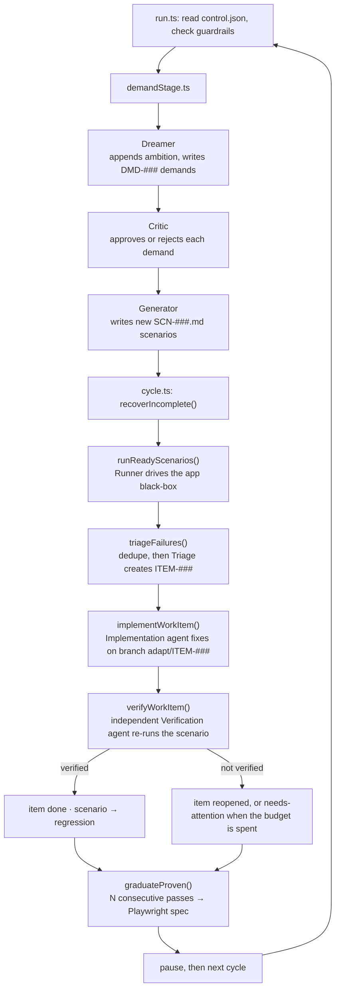

# adapt — Architecture

A map of the codebase for anyone who wants to read, extend, or debug it. Every claim below is traceable
to a source file, cited inline. If a statement here and the code disagree, the code is right — please
open an issue or a PR.

- [Two invariants](#two-invariants)
- [Module map](#module-map)
- [One cycle, traced](#one-cycle-traced)
- [Where state lives](#where-state-lives)
- [The engine abstraction](#the-engine-abstraction)
- [MCP wiring and role permissions](#mcp-wiring-and-role-permissions)
- [Observability](#observability)
- [Lanes and baselines](#lanes-and-baselines)
- [Tests](#tests)

---

## Two invariants

Everything else follows from these.

**1. The orchestrator is deterministic code. It is never an LLM.**
Agents propose; ordinary TypeScript decides. State transitions are table-driven and validated
(`src/orchestrator/stateMachine.ts`, `src/orchestrator/lifecycles.ts`), attempt budgets are counted in
SQLite (`src/orchestrator/store.ts`), and every "did it work" decision belongs to a function, not a
model. An agent that returns a status outside the allowed vocabulary is coerced, not trusted —
`src/orchestrator/runScenario.ts:85` maps any out-of-vocabulary runner verdict to `inconclusive`.

**2. Agents communicate only through files validated by zod schemas.**
`runRole()` (`src/agents/runRole.ts`) is the single funnel: it deletes any stale result file, runs the
agent, then reads the file the prompt asked the agent to write and parses it with a zod schema. An agent
that writes nothing yields `{ status: "missing" }`; one that writes malformed output yields
`{ status: "invalid" }`. Neither ever throws into the loop. Free-text model output is never parsed for
control flow.

---

## Module map

| Directory | Owns |
| --- | --- |
| `src/cli/` | The commander entry point (`index.ts`) plus one module per command under `commands/`. Command cores are plain async functions returning an exit code, with `log` injected — so they are unit-testable without spawning a process. |
| `src/config/` | `schema.ts` is the zod `AdaptConfigSchema` (the single source of truth for every knob and its default); `load.ts` reads and validates `<target>/.adapt/config.json` and throws `ConfigError` with humanized issue bullets. |
| `src/workspace/` | `paths.ts` resolves every `.adapt/` path from a target repo (pure, no IO); `scaffold.ts` creates the workspace, the example config, the example scenario, and `.adapt/.gitignore`. |
| `src/scenarios/` | Scenario files are markdown with YAML frontmatter. `parse.ts` splits and validates them, `schema.ts` is the frontmatter schema, `registry.ts` indexes the directory into `index.json`, `update.ts` rewrites frontmatter status in place. |
| `src/demand/` | The demand engine: `dream.ts` → `critique.ts` → `generate.ts`, sequenced by `demandStage.ts`. `demandStore.ts` persists `DMD-###` JSON files, `northStar.ts` appends ambitions to `north-star.md`. |
| `src/agents/` | `prompts/*.ts` — one file per role. These *are* the behaviour of the system; they are prose and are meant to be read. `runRole.ts` is the run-and-validate funnel described above. |
| `src/engine/` | The coding-agent abstraction. `types.ts` defines `AgentEngine`; `claudeCode.ts` spawns headless Claude Code and parses its stream-json output (`parseStream.ts`); `stubEngine.ts` is a deterministic no-LLM engine; `mcp.ts` decides which MCP servers each role gets. |
| `src/orchestrator/` | The deterministic core: `cycle.ts` (one pass), `evolve.ts` (demand stage + cycle), `run.ts` (the continuous loop), `runScenario.ts`, `triage.ts`, `repair.ts`, `graduate.ts`, plus `orchestrator.ts` (run lifecycle + attempt budgets), `store.ts` (SQLite), `runLedger.ts` (JSON run records), `hooks.ts` (DB setup/teardown shell hooks), `git.ts` (workspace commits). |
| `src/tracker/` | Work items. `localTracker.ts` is the canonical store (one JSON file per `ITEM-###`), `dedupe.ts` computes the deterministic failure fingerprint, `workItem.ts` is the schema. This is the default and only required tracker. Jira is opt-in (`mcp.jira.enabled`, `false` by default) and, when on, a *mirror* driven by the agents through MCP — never the source of truth. |
| `src/lanes/` | Parallel evolutionary lineages: `baseline.ts` (named git tags), `lane.ts` (worktrees, manifests, port allocation, environment commands), `loop.ts` (foreground/detached loop supervision + pidfile), `control.ts` (the pause/stop/maxCycles control file), `ports.ts`, `git.ts`. |
| `src/observability/` | `eventBus.ts` (bounded pub/sub), `events.ts` (the `ConsoleEvent` wire format), `decisionLog.ts` (NDJSON append-only log), `server.ts` (single-run console), `laneSource.ts` + `laneRegistry.ts` + `monitorServer.ts` + `monitor.ts` (multi-lane dashboard), `public/` (the browser UI — plain HTML/CSS/JS, no build step). |
| `src/schemas/` | `export.ts` regenerates the committed JSON Schemas in `src/schemas/generated/` from the zod schemas (`npm run schemas`). |

---

## One cycle, traced

`adapt run` is a loop around `adapt evolve`, which is the demand stage followed by `adapt orchestrate`.
Reading outward-in:

```
adapt run            src/orchestrator/run.ts        loop until a guardrail trips
  └─ adapt evolve    src/orchestrator/evolve.ts     one evolutionary pass
       ├─ demand     src/demand/demandStage.ts      dream → critique → generate
       └─ cycle      src/orchestrator/cycle.ts      validate → triage → repair → verify → graduate
```



### The continuous loop — `src/orchestrator/run.ts`

`runContinuous()` is a `while (true)` with every exit made explicit. Before each cycle it reads
`control.json` (`src/lanes/control.ts`) so the monitor can pause, stop, or re-bound a running loop
without killing the process (`run.ts:68-84`). It then checks, in order: the in-process stop signal, the
control file's `stopRequested`, `maxCycles`, and wall-clock. `maxCycles` from the control file overrides
config when set (`run.ts:43-44`). It calls `runEvolve()` inside a `try`, counts consecutive errors, and
gives up after `run.maxConsecutiveErrors` (`run.ts:105`). The pause between cycles is chunked into 250 ms
slices so a stop request is honoured within a quarter second rather than at the end of the pause
(`run.ts:46-59`). It returns a `stoppedBy` reason: `maxCycles | wallClock | errors | signal | control`.

Guardrails are checked *between* cycles. An in-flight agent is never hard-killed by a guardrail.

**`run.maxCycles` and `run.maxWallClockSeconds` default to `null`, which means infinite**
(`src/config/schema.ts:68-73`). Set them before an unattended run.

### The demand stage — `src/demand/demandStage.ts`

Three agents in sequence:

1. **Dreamer** (`dream.ts`, prompt in `agents/prompts/dreamer.ts`) reads `north-star.md` and the current
   scenario index, proposes one ambition and up to `limits.maxDemandsPerCycle` demands. The ambition is
   *appended* to `north-star.md` (`northStar.ts` — append-only, so vision growth is visible in git
   history). Demands are persisted as `DMD-###` JSON, deduped by normalized title
   (`dedupeDemand.ts`).
2. **Critic** (`critique.ts`) reviews each `proposed` demand against the north star and the existing
   scenario/demand corpus, and approves or rejects it. It gets no browser (`engine/mcp.ts:22`).
3. **Generator** (`generate.ts`) turns each approved demand into up to `limits.maxScenariosPerDemand`
   scenario files. Node — not the agent — assigns the collision-free `SCN-###` ids
   (`generate.ts:21-31`) and validates every generated file, deleting invalid ones.

### The cycle — `src/orchestrator/cycle.ts`

`runCycle()`:

1. **Recover.** `orchestrator.recoverIncomplete()` (`orchestrator.ts:98`) flips runs left at `running`
   by a crashed prior process to `inconclusive`, rewriting both the ledger file and the SQLite index so
   they cannot disagree.
2. **Validate.** `runReadyScenarios()` (`runScenario.ts:107`) runs every scenario whose status is
   `ready`, `active`, or `regression`. Per scenario: resolve the setup hook (scenario-level overrides
   config-level), run it, run the **Runner** agent black-box against `appBaseUrl`, always run teardown,
   then record the verdict. If no setup hook resolves and `hooks.requireSetupHook` is on, the run is
   recorded `blocked` instead of executing against unmanaged database state (`runScenario.ts:38-43`).
   Passes and failures update a consecutive-pass counter (`cycle.ts:54-57`) used later by graduation.
3. **Triage.** `triageFailures()` (`triage.ts`) takes failed runs not already linked to a work item,
   computes a deterministic `dedupeKey` from the run record (`tracker/dedupe.ts` — scenario id, failing
   step, normalized actual outcome, first console and network error). A key collision appends the run to
   the existing item and spends no agent call. Otherwise the **Triage** agent classifies it and a work
   item is created, capped at `limits.maxItemsPerRun` per cycle.
4. **Repair.** For each new item, and then for pre-existing items in `reopened` or
   `ready-for-verification` (`cycle.ts:75-81`), `driveItem()` runs the **Implementation** agent and then
   the **Verification** agent. `repair.ts:48` computes the branch name `adapt/<ITEM-ID>` and interpolates
   it into the prompt; creating that branch and committing on it are things the prompt *asks* the agent to
   do (`agents/prompts/implementation.ts`), not operations adapt performs or verifies. Every status change goes
   through `assertTransition()` against `WORK_ITEM_TRANSITIONS`, so an illegal move throws rather than
   silently corrupting state (`repair.ts:26-31`).
5. **Graduate.** `graduateProven()` (`graduate.ts`) takes every non-graduated scenario whose consecutive
   passes have reached `limits.gradPassThreshold` and asks the **Graduation** agent to write a
   deterministic Playwright spec into `config.playwrightTestDir`. The spec is kept only if the agent
   exited 0 and the file is non-empty; otherwise it is removed and the scenario is left alone
   (`graduate.ts:52-58`).

### The separation that makes verification mean something

The implementing agent never closes its own work item. `implementWorkItem()` moves the item only as far
as `ready-for-verification` (`repair.ts:65-67`). A separate **Verification** agent, with a different
prompt and black-box browser access, owns the done/reopen decision (`repair.ts:103-114`). A verification
run that produces no valid result is treated as *inconclusive*: no attempt is consumed and the item stays
at `ready-for-verification` for a later retry, so infrastructure flakiness can never be recorded as
"still broken" (`repair.ts:96-99`).

Attempt budgets are per scenario and per kind (`fix` / `verification`), counted in SQLite
(`store.ts:83-95`) and enforced by `orchestrator.canAttempt()` (`orchestrator.ts:86`). Exhausting a
budget parks the item at `needs-attention` — a terminal state (`lifecycles.ts:27`) that only a human
clears.

---

## Where state lives

All target state lives inside the target repository, under `.adapt/`. Paths are resolved by
`src/workspace/paths.ts`; the directories created at `init` time come from `src/workspace/scaffold.ts`.

| Artifact | Path | Written by |
| --- | --- | --- |
| Config | `.adapt/config.json` (plus the generated `config.example.json`) | you (`scaffold.ts` writes the example) |
| Product vision | `.adapt/north-star.md` | Scout at `init`; appended by the Dreamer each cycle (`demand/northStar.ts`) |
| Scenarios | `.adapt/scenarios/*.md` + `index.json` | you and the Generator; indexed by `scenarios/registry.ts` |
| Run records | `.adapt/scenario-runs/<RUN-ID>.json` (+ `<RUN-ID>.agent.json`, the raw agent result) | `orchestrator/runLedger.ts`, `runScenario.ts:60` |
| Work items | `.adapt/work-items/ITEM-###.json` (+ `impl-*.json`, `verify-*.json`, `triage-*.json` agent results) | `tracker/localTracker.ts`, `repair.ts`, `triage.ts` |
| Demands | `.adapt/demands/DMD-###.json` (+ `dream.json`, `critic-*.json`) | `demand/demandStore.ts` |
| Decision log | `.adapt/decision-log/<YYYY-MM-DD>.ndjson` | `observability/decisionLog.ts` |
| Index / counters | `.adapt/state.db` (+ `-wal`, `-shm`) | `orchestrator/store.ts` |
| Baselines | `.adapt/baselines/<name>.json` | `lanes/baseline.ts` |
| Lane manifest | `.adapt/lane.json` (inside a lane worktree) | `lanes/lane.ts` |
| Lane control | `.adapt/control.json` (inside a lane worktree) | `lanes/control.ts`, written by the monitor |
| Loop pidfile | `.adapt/loop.pid` | `lanes/loop.ts` |

**Files are the source of truth; SQLite is an index.** `RunLedger.write()` validates a run record, writes
the JSON file, and *then* upserts a row into the store (`runLedger.ts:16-24`). The database holds only
what needs to be queried or counted: run rows, scenario state, attempt counts, consecutive passes
(`store.ts:23-47`). It is opened in WAL mode (`store.ts:19`), which is why `state.db-wal` and
`state.db-shm` exist. Deleting `state.db` loses counters, not history.

`.adapt/verification-reports/` is created by the scaffold but nothing currently writes into it.

---

## The engine abstraction

`src/engine/types.ts` is the whole contract:

```ts
interface AgentEngine {
  run(spec: AgentSpec, onEvent: (e: AgentEvent) => void): Promise<AgentResult>;
}
```

An `AgentSpec` is `{ role, prompt, cwd, mcpServers?, env? }`. Events are one of seven kinds —
`agent.start`, `agent.thinking`, `agent.tool_call`, `agent.tool_result`, `agent.text`, `agent.error`,
`agent.exit` — streamed as they happen.

Two implementations ship:

- **`ClaudeCodeEngine`** (`src/engine/claudeCode.ts`) spawns the `claude` CLI headless. `buildClaudeArgs()`
  (`claudeCode.ts:77`) assembles `-p <prompt> --output-format stream-json --verbose --strict-mcp-config`,
  optional `--model`, one `--mcp-config` per requested server, and — by default —
  `--dangerously-skip-permissions`. That last flag is the only one gated by config: `engine.skipPermissions`
  (default `true`) reaches the constructor via `engineFor()` / `engineOptionsFor()`
  (`src/cli/commands/engineFor.ts`), the single place every config-loading command builds its engine;
  `false` omits the flag. `adapt init` is the deliberate exception — it constructs a bare
  `ClaudeCodeEngine()` because the Scout runs before `.adapt/config.json` exists.
  stdin is deliberately closed (`claudeCode.ts:109`) because the prompt
  arrives via `-p`; leaving it open makes the CLI wait and emit a spurious error. stdout is parsed line by
  line into `AgentEvent`s by `parseStream.ts`.
- **`StubEngine`** (`src/engine/stubEngine.ts`) is deterministic, spawns nothing, and takes an optional
  `script` that returns a fixed event list. Setting `engine.type: "stub"` in config runs the entire
  pipeline — workspace, registry, ledger, state machine, decision log, console — with no LLM, no browser,
  and no API cost. Every test in the suite uses it.

Adding a third engine means implementing that one method. Nothing above `src/engine/` knows what a model is.

---

## MCP wiring and role permissions

`src/engine/mcp.ts` maps a role to *logical* MCP server names, filtered by the config toggles:

| Role | Browser | Jira (only when `mcp.jira.enabled`, off by default) | Source |
| --- | --- | --- | --- |
| Scout (`init` only) [^scout] | none | no | reads the repo; writes only `north-star.md` |
| Dreamer | Chrome DevTools | no | reads |
| Critic | none | no | reads |
| Generator | Chrome DevTools | no | reads |
| Runner | Playwright | no | black-box: no source access |
| Triage | Chrome DevTools | yes | reads |
| Implementation | Chrome DevTools | yes | writes product code |
| Verification | Playwright | yes | black-box re-run |
| Graduation | Chrome DevTools | no | reads; writes the Playwright spec |

[^scout]: The Scout is the one role `mcp.ts` knows nothing about — `RoleName` has no `scout` member, so
    `mcpServersFor()` is never called for it. `src/cli/commands/init.ts` builds the spec by hand with no
    `mcpServers` field at all and constructs its own `ClaudeCodeEngine()` with no config, because `init`
    runs before `.adapt/config.json` exists. The row is listed here for completeness of the permission
    picture, not because the toggles apply to it.

Read `mcp.ts:15-25` for the authoritative version: black-box roles (`runner`, `verification`) get
Playwright, white-box roles get Chrome DevTools, the Critic gets no browser, and Jira reaches only
`triage`, `implementation`, and `verification` — never the Runner and never the demand roles.

The logical names become concrete server launches in `resolveMcpConfig()` (`claudeCode.ts:60-74`):
`playwright` → `npx -y @playwright/mcp@latest --isolated` (isolated so login state cannot leak between
scenarios), `chrome-devtools` → `npx -y chrome-devtools-mcp@latest`, `jira` → `uvx mcp-atlassian` with
credentials harvested from the environment by `jiraMcpEnv()` (`claudeCode.ts:38-57`). That function
forwards only variables that are actually set, and treats PAT auth and Cloud basic auth as mutually
exclusive so a stray ambient `JIRA_API_TOKEN` cannot hijack a self-hosted run. **Credentials come from
the environment, never from `config.json`.**

The other half of the permission model is prose. Each role's boundary is stated in its prompt under
`src/agents/prompts/` — the Runner is told it has no source access, the Verification agent is told it must
not trust the implementer's report. Those files are the behavioural spec of the system and are worth
reading before changing anything.

---

## Observability

One event type flows everywhere: `ConsoleEvent` (`src/observability/events.ts`), produced from either an
`AgentEvent` or an `OrchestratorEvent` and tagged with a `channel`.

```
agents ─┐
        ├─► EventBus ─┬─► DecisionLog  → .adapt/decision-log/<day>.ndjson
orch ───┘             └─► ObservabilityServer → WebSocket /ws → browser
```

- **`EventBus`** (`eventBus.ts`) is synchronous pub/sub with a bounded replay buffer (500 events). It is
  process-local — one bus per running command.
- **`DecisionLog`** (`decisionLog.ts`) appends every event as NDJSON, one file per day. This is the
  durable record; it is what the monitor replays for a lane that is not currently streaming.
- **`ObservabilityServer`** (`server.ts`) serves `src/observability/public/` over HTTP and the event
  stream over `/ws`. On connect it snapshots the backlog and flushes it before live events, queueing
  anything that arrives in between so replay-then-live ordering is preserved (`server.ts:28-50`).
  `adapt run --console <port>` starts one (`cli/commands/run.ts:52`).
- **`demoConsole`** (`console.ts`) is what `adapt console` starts. With `runStub` it publishes one stub
  agent to prove the pipe end to end.
- **The monitor** (`monitor.ts`, `monitorServer.ts`, `laneRegistry.ts`, `laneSource.ts`) aggregates lanes.
  `LaneRegistry` rescans the lanes root every 2 s and diffs it. Each `LaneSource` prefers a live
  WebSocket to that lane's console port and falls back to replaying the lane's decision log
  (`laneSource.ts`). The monitor also writes lane control commands — pause, continue, stop, start,
  restart, `maxCycles` — dispatched by the pure `applyControl()` function (`monitor.ts:21-41`).

Both servers bind loopback and have no authentication. That is deliberate for a local dev tool; see
`SECURITY.md`.

---

## Lanes and baselines

A **baseline** is a named fork point: `adapt baseline create <name> <repo>` requires a clean tree and at
least one commit, creates git tag `adapt-baseline/<name>`, writes `.adapt/baselines/<name>.json`, and
commits that manifest into the target repo (`src/lanes/baseline.ts:20-47`).

A **lane** is an isolated evolutionary lineage forked from a baseline: a git worktree at
`<lanes.rootDir>/<laneId>` on branch `adapt/<laneId>`, with its own `.adapt/` workspace, its own
`state.db`, an allocated port block, an allocated console port, and an optional pinned model
(`src/lanes/lane.ts:85-134`). Lane ids must match `/^[a-z0-9][a-z0-9-]{0,38}$/` because they become branch
names, compose project names, and paths (`lane.ts:66-68`).

Bringing a lane's environment up is the *target's* responsibility: `environment.up` / `reset` / `down` are
shell commands from the target's config, run with `ADAPT_LANE_ID`, `ADAPT_COMPOSE_PROJECT`, and
`ADAPT_PORT_BASE` injected (`lane.ts:44-63`). `scripts/lane-up.template.sh` is a worked example.

`adapt lane start` runs the loop in the foreground (streaming to the lane's console port) or, with
`--detach`, as a background process recorded in `.adapt/loop.pid` (`src/lanes/loop.ts:37-86`). The
pidfile is what `lane stop`, `lane list`, and the monitor use to tell running from stopped
(`loop.ts:107-115`).

---

## Tests

Tests live under `test/`, mirroring `src/` directory for directory — one test file per source module, so
the file count tracks the module count; `npm test` prints the current totals. The suite runs in a
few seconds because **no test ever calls a real model**: agent behaviour is exercised through
`StubEngine` with scripted events, and every seam that touches the outside world — clocks, sleeps, spawn,
WebSocket clients, control-file readers — is an injectable dependency with a real default. `runContinuous`
(`orchestrator/run.ts:19-23`) and `LaneSource` (`observability/laneSource.ts:18-30`) are the clearest
examples of that pattern.

The gate is `npm run typecheck && npm test`. See `CONTRIBUTING.md`.
